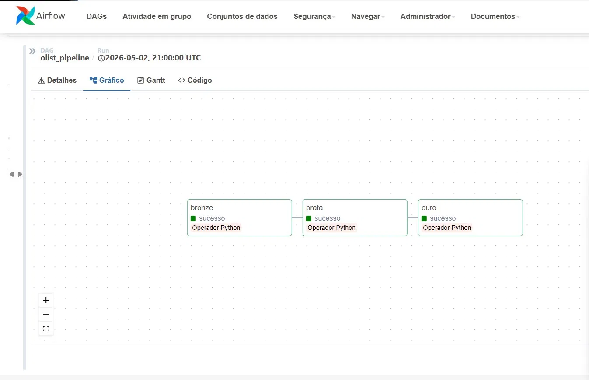
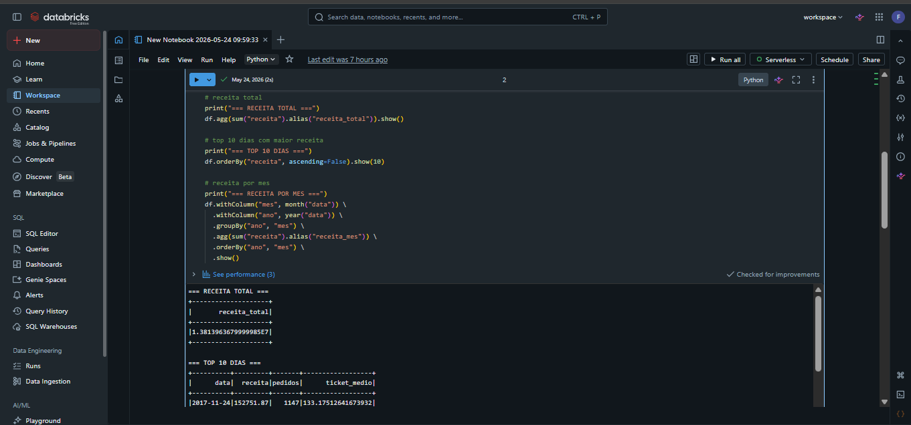
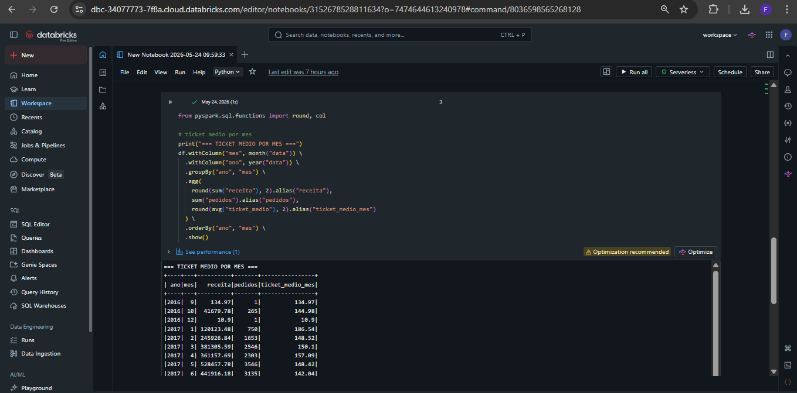

# 🏗️ Data Engineering Pipeline — Olist E-commerce

Pipeline de engenharia de dados end-to-end utilizando dados públicos do e-commerce brasileiro Olist. O projeto implementa uma arquitetura Medallion (Bronze, Silver e Gold) com armazenamento em Azure Data Lake Gen2, orquestração via Apache Airflow e análises exploratórias realizadas no Databricks com PySpark.

---

## 📐 Arquitetura da Solução

O pipeline segue uma arquitetura em camadas para garantir organização, qualidade e escalabilidade dos dados.

```text
Olist CSV Dataset
        │
        ▼
Azure Data Lake Gen2
        │
        ▼
Bronze Layer
(Ingestão Raw)
        │
        ▼
Silver Layer
(Limpeza e Enriquecimento)
        │
        ▼
Gold Layer
(Métricas de Negócio)
        │
        ▼
Databricks + PySpark
(Análises e Insights)
```

---

## 🛠️ Stack Tecnológica

| Ferramenta | Finalidade |
|------------|------------|
| Python | Transformações e processamento de dados |
| Apache Airflow | Orquestração do pipeline |
| Docker | Containerização do Airflow |
| Azure Data Lake Gen2 | Armazenamento das camadas Bronze, Silver e Gold |
| Databricks | Ambiente de processamento distribuído |
| PySpark | Transformação e análise dos dados |
| GitHub | Versionamento do projeto |

---

## 📊 Pipeline de Dados

### 🥉 Bronze Layer

Responsável pela ingestão dos dados brutos.

- Leitura dos arquivos CSV do dataset Olist
- Conversão para formato Parquet
- Armazenamento sem transformações

### 🥈 Silver Layer

Responsável pela limpeza e enriquecimento dos dados.

- Filtragem de pedidos entregues
- Tratamento de inconsistências
- Junção das tabelas:
  - Orders
  - Order Items
  - Customers
  - Products
  - Payments

### 🥇 Gold Layer

Responsável pela geração de métricas de negócio.

- Receita diária
- Quantidade de pedidos
- Ticket médio
- Indicadores para análise estratégica

---

## 🌬️ Apache Airflow

### DAG do Pipeline




O Airflow é responsável pela execução automatizada das etapas Bronze, Silver e Gold, garantindo o fluxo correto dos dados entre as camadas.

---

## ⚡ Databricks & PySpark

### Análises





As análises exploratórias foram realizadas utilizando PySpark dentro do Databricks, permitindo o processamento distribuído dos dados.

---

## 📈 Principais Insights

| Métrica | Resultado |
|----------|------------|
| Receita Total | R$ 13,8 milhões |
| Maior Dia de Vendas | 24/11/2017 (Black Friday) |
| Receita no Pico | R$ 152 mil |
| Período Analisado | 2016–2018 |
| Tendência | Crescimento consistente |

### Destaques

- Identificação do impacto da Black Friday nas vendas.
- Crescimento contínuo da receita ao longo do período analisado.
- Consolidação de métricas de negócio para tomada de decisão.

---

## 📂 Estrutura do Projeto

```text
data-engineer-project/
│
├── dags/
│   └── pipeline_dag.py
│
├── pipelines/
│   ├── bronze.py
│   ├── silver.py
│   ├── gold.py
│   └── azure_client.py
│
├── data/
│   └── raw/
│
├── docker-compose.yml
│
└── README.md
```

---

## 🚀 Como Executar

### 1. Clonar o repositório

```bash
git clone https://github.com/felipeab99/data-engineer-project.git
```

### 2. Configurar as variáveis de ambiente

```env
AZURE_CONNECTION_STRING=sua_connection_string
```

### 3. Iniciar o Airflow

```bash
docker-compose up -d
```

### 4. Acessar o Airflow

```text
http://localhost:8080
```

Executar a DAG:

```text
olist_pipeline
```

---

## 📦 Dataset

Dataset público disponibilizado pela Olist no Kaggle:

https://www.kaggle.com/datasets/olistbr/brazilian-ecommerce

---

## 🎯 Competências Demonstradas

- Engenharia de Dados
- ETL / ELT
- Apache Airflow
- Azure Data Lake Gen2
- Databricks
- PySpark
- Docker
- Arquitetura Medallion
- Data Lake
- Orquestração de Pipelines
- Análise Exploratória de Dados

---

## 🔮 Melhorias Futuras

- Implementação de testes automatizados
- Monitoramento e alertas no Airflow
- Dashboard em Power BI
- Integração com Azure Data Factory
- Deploy em ambiente cloud produtivo
- Implementação de Data Quality Checks
